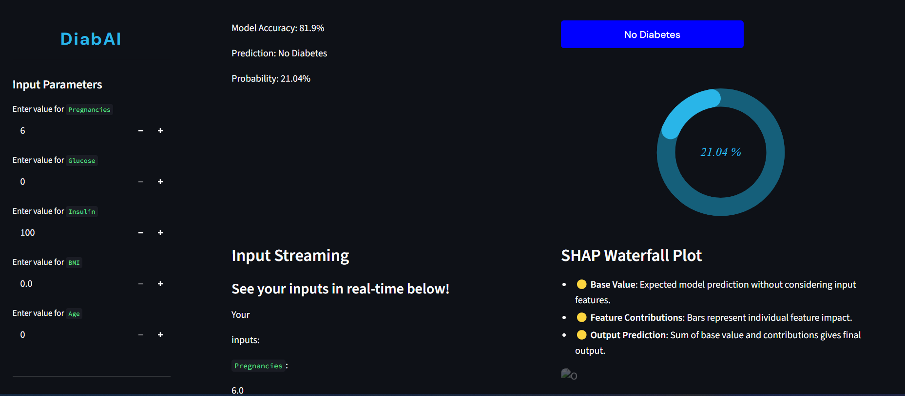
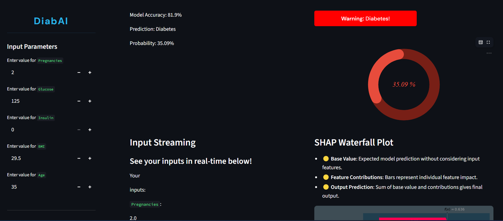
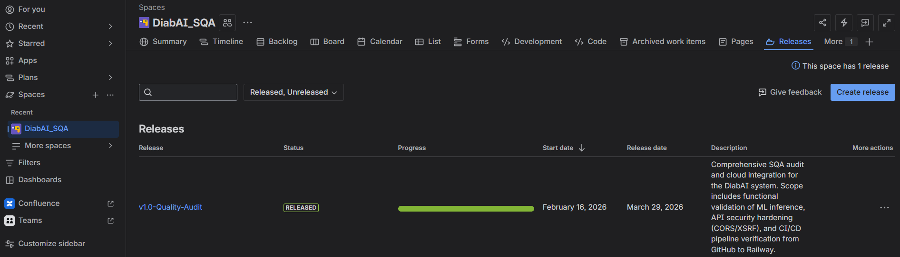

# DiabAI — SQA Audit Repository

- **Version:** v1.0-Quality-Audit
- **Release Date:** 29 March 2026
- **Audit Status:** ✅ Released — Zero Open Defects

> This repository contains the complete Software Quality Assurance 
> audit documentation for the DiabAI Diabetes Prediction System.
> The application itself is maintained in a separate repository —
> linked below.

---

## 🔗 Project Repository
[DiabAI — Diabetes Prediction System](https://github.com/Syed-Ammar-21/Diabetes-Prediction-main)

---

## Audit Scope

### 18 test cases across 5 user stories, executed and tracked in Jira under Epic DS-1. Testing methodology included:

- Black-Box Testing
- Boundary Value Analysis (BVA)
- Integration Testing (Modular Audit)
- ML-Specific Validation (SHAP, probability threshold integrity)
- API Security Testing (CORS/XSRF via Postman)
- Performance Profiling (Chrome DevTools)
- CI/CD Pipeline Verification (GitHub Actions + Railway)
- Full Regression Cycle post bug-fix

---

## Critical Defects Found

### 🔴 DS-25 — Logical Validation Gap (High Priority)
The system accepted medically impossible values 
(Glucose = 0, Age = 0) without error and produced 
skewed predictions on phantom data.

- **Root cause:** Missing lower-bound constraints on 
critical input fields.
- **Resolution:** Physiologically valid minimums enforced 
with user-facing validation warnings.
- **Status:** ✅ Resolved — 28 March 2026

---

### 🔴 DS-26 — Prediction Logic Mismatch (High Priority)
The UI displayed a "Diabetic" result for a probability 
score of 35% — well below the 50% classification threshold.

- **Root cause:** Hardcoded frontend condition operating 
independently of the model's predict method.
- **Resolution:** UI classification standardized at ≥ 0.50 
directly from model output across the full pipeline.
- **Status:** ✅ Resolved — 28 March 2026

---

## Defect Evidence

- ### DS-25 — Logic Validation

- ### DS-26 — UI displaying "Diabetic" at 35.09% probability

- ### Jira Release — v1.0-Quality-Audit

---

## Documentation

| Document | Description |
|---|---|
| [Software Test Plan (STP)](docs/Diab_AI_SQA_Test_Plan.pdf) | Test strategy, scope, methodology, entry/exit criteria |
| [Test Case Suite (TCS)](docs/Diab_AI_SQA_Test_Case_Suite.pdf) | All 18 test cases with steps, data, and results |
| [Audit Release Summary (ARS)](docs/Diab_AI_SQA_Audit_Release_Report.pdf) | Quality gates, regression history, formal sign-off |

---

## Test Execution Summary

| Result | Count |
|---|---|
| ✅ Pass | 17 |
| ⚠️ Conditional Pass | 1 |
| ❌ Fail | 0 |
| **Total** | **18** |

---

**Prepared by:** Syed Ammar Zulfiqar
**Role:** SQA Engineer
**Classification:** Portfolio / Public
